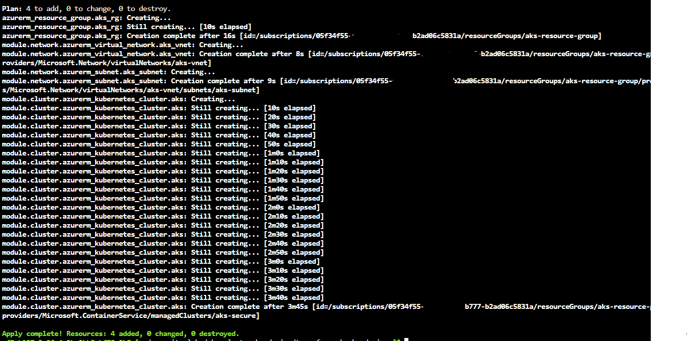
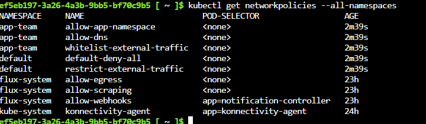
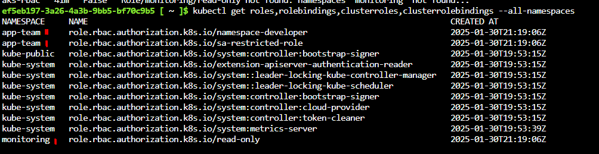

# **🔒 AKS Cluster Hardening**
**Step-by-step guide to secure and harden an Azure Kubernetes Service (AKS) cluster.**

---

## **📌 Overview**
This project focuses on **hardening an AKS cluster** by implementing best practices, including:
- **Secure infrastructure provisioning with Terraform**
- **Applying RBAC policies for least privilege**
- **Enforcing Network Policies for traffic control**

For **GitOps and configuration management**, refer to the separate repository: [AKS-GITOPS-SECURITY](https://github.com/your-repo/aks-gitops-security).

---

## **📁 Project Structure**
- 📂 **terraform/** → Terraform files to provision AKS securely  
- 📂 **rbac/** → Role-Based Access Control (RBAC) configurations  
- 📂 **network-policies/** → Network Policies to isolate and secure traffic  
- 📂 **images/** → Screenshots and visual documentation  

---

### **Cluster Creation with Terraform**
The cluster was provisioned using **Terraform**, ensuring secure configurations for resources like Resource Groups, Virtual Networks, and the AKS cluster itself.

> **Explanation**:  
> - Resource Group, Virtual Network, and Subnet were created first.  
> - The AKS cluster (`aks-secure`) was provisioned in a private network, adhering to security best practices.

---

### **Network Policies**
Network Policies were applied to control traffic between pods and namespaces.

> **Explanation**:  
> - **`default-deny-all`** blocks all traffic by default in the `default` namespace.  
> - **`allow-dns`** allows pods in `app-team` to resolve DNS.  
> - **`whitelist-external-traffic`** restricts egress traffic to specific external IPs.  

---

### **RBAC Configurations**
RBAC roles and bindings were applied to enforce the principle of least privilege.

> **Explanation**:  
> - **`namespace-developer`** role restricts developers to a specific namespace.  
> - **`read-only`** role allows monitoring users to view resources in the `monitoring` namespace.
